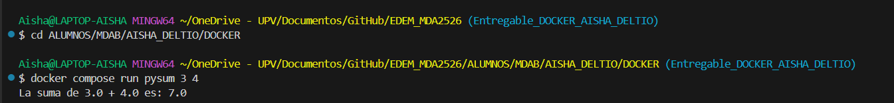
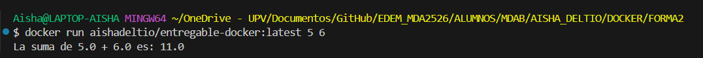

## 🚀 Mis Apuntes de Docker: Modo Desarrollo vs. Modo Producción

Aquí apunto los dos modos de trabajo que he aprendido con Docker: uno para desarrollar (programar y probar) y otro para publicar (cuando ya está todo listo).

---

### 1. 🛠️ MODO DESARROLLO (para programar)

Mi objetivo aquí es poder programar y ver los cambios al momento, sin tener que estar reconstruyendo la imagen todo el rato.

Para esto, lo más importante es usar **Docker Compose** con **volúmenes**.

#### ⌨️ Comandos que uso en Desarrollo

* **pysum**: Es el nombre que le di al servicio en el `compose.yaml`. Lo uso con `docker compose`.
* **entregable\_docker**: Es el nombre del contenedor. Lo uso con comandos de `docker`.

##### Para ejecutar mi script una vez:

* `docker compose run pysum 3 4`
    * Ejecuto el servicio 'pysum' con los números 3 y 4.
    * Esto ejecutará dentro del contenedor: `python main_docker.py 3 4` (por el entrypoint).
    * Crea un contenedor temporal, e ignora `container_name` (entregable\_docker) para evitar conflictos si ejecutas varios `run` del mismo servicio.
    * Se nos crea un contenedor con un nombre random, si queremos darle nombre: `docker compose run --name entregable pysum 3 4`
    * Si queremos borrar el contenedor cada vez que se acabe de ejecutar: `docker compose run --rm pysum 3 4`

##### CAPTURA IMAGEN FUNCIONAMIENTO:



#### ❓ Dudas y Problemas que he tenido

**Duda 1: Si hago `docker compose up` y luego `docker compose run pysum 3 4`, se crean dos contenedores.**
* **Conclusión:** Claro, `up` crea un contenedor para el servicio y `run` crea *otro nuevo* para la tarea.

**Duda 2: Si hago `docker compose up` y luego `docker start -ai entregable_docker 4 5` no pasa los argumentos.**
* **Conclusión:** `docker` lo lee como que quiero hacer `start` a varios contenedores, no le puedo pasar argumentos.

**Duda 3: Si hago `docker compose up` y luego `docker start -ai entregable_docker`**
* **Conclusión:** La salida es el `except`, ya que no le estoy pasando argumentos.

**Duda 4: Si hago `docker compose up -d`, `docker exec -it entregable_docker bash`**
* **Conclusión:** No me deja entrar al contenedor, ya que una vez pasa por el `entrypoint` Docker lo para.
* Incluso si hago antes `docker start -ai entregable_docker`, me lo sigue parando. --> La solución a esto sería añadir un bucle infinito.


---

## 2. NOTAS: UN GRAN PROBLEMA QUE HE TENIDO:

Intenté crear una imagen con `docker compose` con un build mount, a continuación, la explicación de por qué no me funcionaba:

> Cuando usé `docker compose run`, la línea `volumes: - ".:/app"` montó en mi carpeta local (que contiene `main_docker.py`) dentro del contenedor. El archivo nunca estuvo realmente dentro del sistema de archivos del contenedor, solo era un "acceso directo" a mi máquina.
>
> Al hacer `docker push`, cree una imagen a partir del estado del contenedor, pero los volúmenes montados se ignoran en ese proceso. Por lo tanto, cree una imagen basada en `python:3.11-slim` que tiene el `entrypoint` configurado, pero sin el archivo `main_docker.py` dentro.
>
> Por eso, al ejecutar la nueva imagen, el `entrypoint` (`python main_docker.py`) falla con el error `"No such file or directory"`.

Entonces, tengo que hacerlo con **dockerfile** --> **MODO PRODUCCIÓN** (para publicar)

---

## 3. 🚢 MODO PRODUCCIÓN (PARA PUBLICAR)

Esta forma se hace con el objetivo de construir una imagen en mi dockerhub , no trabajamos con volumenes porque ya hemos visto **QUE NO SE PUEDE**. La clave aquí es usar un **dockerfile** además del **dockercompose** y el **main\_docker\_2.py**.

En este caso, el truco está en decirle al docker compose con el comando `build` que utilice la imagen que se encuentra almacenada en el dockerfile.

#### Pasos:

* `docker build -t aishadeltio/entregable-docker:latest .` --> construimos la imagen
* `docker login` --> iniciamos sesión
* `docker push aishadeltio/entregable-docker:latest` --> subimos la imagen

#### Para comprobar que ha funcionado:

* `docker pull aishadeltio/entregable-docker:latest` --> en docker hub, entramos en repositorio, tags y nos sale este enlace
* `docker images` --> comprobamos que efectivamente hemos descargado la imagen
* `docker run aishadeltio/entregable-docker:latest 5 6` --> ejecutamos la imagen

#### CAPTURA FUNCIONAMIENTO:




#### 💡 Duda Final: ¿Y si otra persona usa mi `docker-compose.yaml`?

Me surgió esta duda: si una persona se descarga mi imagen de Docker Hub y tiene mi archivo `docker-compose.yaml`, ¿puede hacer `docker compose up` y que funcione?

**La respuesta es: Depende de cómo esté escrito mi `compose.yaml`:**

1.  **✅ SI mi `compose.yaml` usa `image:`** (El método para producción)

    ```yaml
    services:
      pysum:
        image: aishadeltio/entregable-docker:latest
        # ... (resto de configuración)
    ```
    En este caso, **SÍ, funcionará perfectamente**. `docker compose up` buscará la imagen `aishadeltio/entregable-docker:latest` localmente, y como la persona ya la tiene descargada, la usará.

2.  **❌ NO si mi `compose.yaml` usa `build:`** (El método que usaba en desarrollo)

    ```yaml
    services:
      pysum:
        build: .
        # ... (resto de configuración)
    ```
    En este caso, **NO usará la imagen que descargó**. `docker compose up` intentará *construir* una imagen nueva desde cero, y para eso necesitaría también mi `Dockerfile` y todo mi código fuente (el `main_docker_2.py`).

**Conclusión:** Para que la gente pueda usar mi imagen publicada, el `docker-compose.yaml` que comparta debe usar la clave **`image:`**, no **`build:`**.

